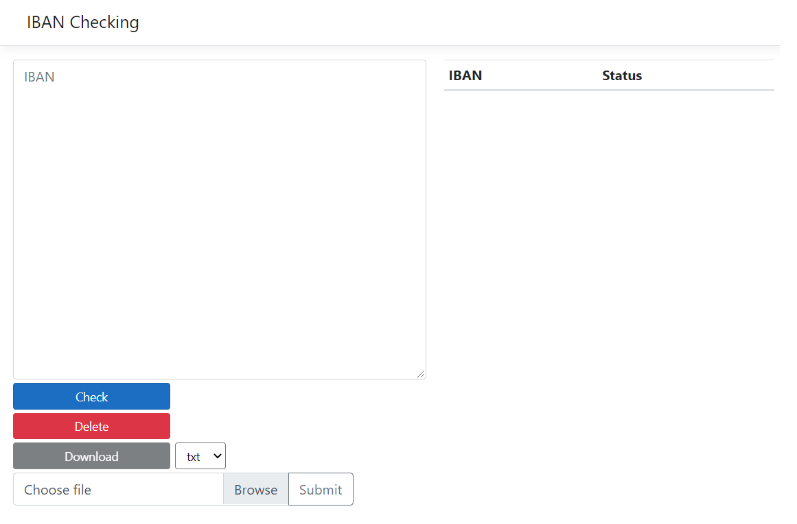

# IBAN Checking

IBAN Checking is a awesome software for for IBAN number checking. It can test IBAN for one account and provided list.

# Where to find

You can find this software on site: https://ibancheckingweb20210711204029.azurewebsites.net

# interface architecture

You can check IBAN(s) validation in two ways:
<ul>
<li>write IBAN in text area</li>
<li>upload file with IBAN list</li>
</ul>

IBANS can be seperated by these seperators:
<ul>
<li>new line (\n)</li>
<li>tab (\t)</li>
<li>semicolon (;)</li>
</ul>

You can see IBAN(s) reslts in two ways:
<ul>
<li>in table</li>
<li>download it</li>
</ul>

